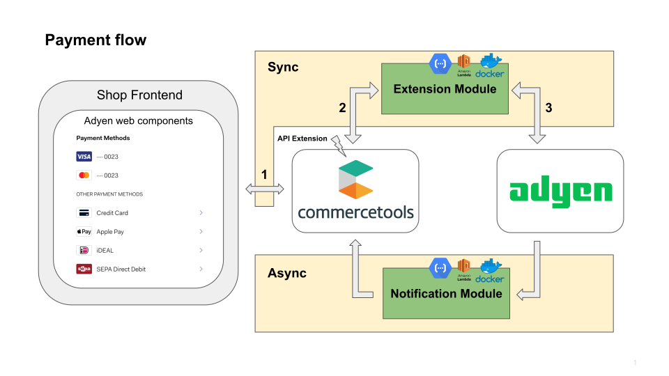

# commercetools-adyen-integration

`commercetools-adyen-integration` provides an [Adyen Web Components](https://docs.adyen.com/checkout/components-web) based integration between the commercetools and Adyen PSP.

<!-- START doctoc generated TOC please keep comment here to allow auto update -->
<!-- DON'T EDIT THIS SECTION, INSTEAD RE-RUN doctoc TO UPDATE -->

- [Supported features](#supported-features)
- [Supported payment methods](#supported-payment-methods)
- [Overview](#overview)
  - [Extension module](#extension-module)
  - [Notification module](#notification-module)
- [Other guides](#other-guides)

<!-- END doctoc generated TOC please keep comment here to allow auto update -->

## Supported features

- [Adyen Web Component](https://docs.adyen.com/checkout/components-web) based payment methods.
For full list of payment methods that have been tested for CommerceTools integration please refer to
[supported payment methods section](#supported-payment-methods) of this document.
  - Note: since the integration relies on the usage of Adyen's web components it does not need to process sensitive credit card data and thus is fully PCI DSS **compliant**.
- Asynchronous notifications handling via [notification module](#notification-module).
- [Multi-tenancy](./extension/docs/WebComponentsIntegrationGuide.md#multi-tenancy) to serve multiple Adyen merchant accounts/commercetools projects with one application instance.
- [Refunding](./extension/docs/Refund.md) a payment back to the shopper.
- Authorisation [cancellation](./extension/docs/CancelPayment.md) on a payment that has not yet been captured.
- [Manual capture](./extension/docs/ManualCapture.md) of a payment.
- [Restore](./extension/docs/Restore.md), which gives your shoppers an opportunity to offset their carbon emissions from the delivery or lifecycle of their purchase at checkout. 
- [Store payment](./extension/docs/StorePayment.md) and [disable stored payment](./extension/docs/DisableStoredPayments.md) gives your shoppers the ability to store payments for later use and removing these stored payments.

## Supported payment methods

### Credit and debit cards

- [Credit/debit cards](https://docs.adyen.com/payment-methods/cards/)

### Buy Now Pay Later

- [Klarna Pay Later](https://docs.adyen.com/payment-methods/klarna/)
- [Afterpay](https://docs.adyen.com/payment-methods/afterpaytouch/)

### Cash and ATM payment methods

- [Multibanco](https://docs.adyen.com/payment-methods/multibanco/)

### Online payments

- [iDEAL](https://docs.adyen.com/payment-methods/ideal/)
- [Sofort (Online bank transfer)](https://docs.adyen.com/payment-methods/sofort/)
- [BLIK](https://docs.adyen.com/payment-methods/blik/)
- [MobilePay](https://docs.adyen.com/payment-methods/mobilepay/)
- [Online banking Poland](https://docs.adyen.com/payment-methods/online-banking-poland/)
- [Klarna Pay now](https://docs.adyen.com/payment-methods/klarna/)

### Wallets

- [PayPal](https://docs.adyen.com/payment-methods/paypal/)
- [Apple Pay](https://docs.adyen.com/payment-methods/apple-pay/)
- [Google Pay](https://docs.adyen.com/payment-methods/google-pay/)
- [Bancontact](https://docs.adyen.com/payment-methods/bancontact/)
- [Vipps](https://docs.adyen.com/payment-methods/vipps/)
- [Swish](https://docs.adyen.com/payment-methods/swish/)

### Prepaid and gift cards

- [Givex](https://docs.adyen.com/payment-methods/gift-cards/)

### Mobile

- [TWINT](https://docs.adyen.com/payment-methods/twint/)

## Overview
This repository contains two standalone modules that interact with commercetools and Adyen.
Complete integration requires running both of the modules.

1. Front end uses [Adyen Web Components](https://docs.adyen.com/checkout/supported-payment-methods) to present required payment methods. The list of available payment methods can be also obtained through the integration with the help of [get available payment methods request](./extension/docs/WebComponentsIntegrationGuide.md#step-3-get-available-payment-methods-optional). On user interaction, frontend web-component generates JSON payloads for [create payment sessions](https://docs.adyen.com/online-payments/web-components#create-payment-session) which has to be provided to commercetools payment as described [here](./extension/docs/WebComponentsIntegrationGuide.md#web-components-integration-guide).  
2. With help of the [commercetools HTTP API Extensions](https://docs.commercetools.com/api/projects/api-extensions) provided data is sent to the Extension Module.
3. The Extension Module processes provided web component payload passed by the front end, exchanges it with Adyen API, and provides **synchronous** response back to the front end / commercetools caller. Based on result, the front end either creates an order or continues with further payment steps as described in the [integration guide](./extension/docs/WebComponentsIntegrationGuide.md#web-components-integration-guide). Note that order/cart creations/modifications should be part of the front end business logic. `commercetools-adyen-integration` will neither change the cart nor the order.

In addition with help of Adyen notifications any payment status changes are **asynchronously** exchanged between Adyen and commercetools.
Please follow the detailed guides below in order to integrate your front end with the Extension and Notification modules.

### Extension module 

The extension module is a publicly exposed service that acts as a middleware between the commercetools platform and Adyen. 
Once [commercetools HTTP API Extensions](https://docs.commercetools.com/api/projects/api-extensions) is configured to call Adyen extension module, for every payment create or update request an Adyen extension will be remotely called by the commercetools platform.

- Follow [Integration Guide](./extension/docs/WebComponentsIntegrationGuide.md) for information how to integrate your shop with this module.
- Follow [How to run](extension/docs/HowToRun.md) the extension module.

### Notification module 

Notification module is a publicly exposed service which receives asynchronous notifications sent by Adyen.
Through notifications, Adyen provides asynchronously payment status changes like authorization, charge, or refund of the payment.
The notification module will process the notification sent by Adyen and matches the commercetools payment for this notification, and modifies commercetools payment accordingly.

- Follow [Integration Guide](./notification/docs/IntegrationGuide.md) for information how to integrate with notification module.
- Follow [How to run](notification/docs/HowToRun.md) the notification module.

## Other guides
 
- Follow the [FAQ](docs/FAQ.md) for the answers to frequently asked questions, such as order creation, deployment etc. 
- Follow the [Contribution Guide](docs/ContributionGuide.md) if you would like to run modules locally.
