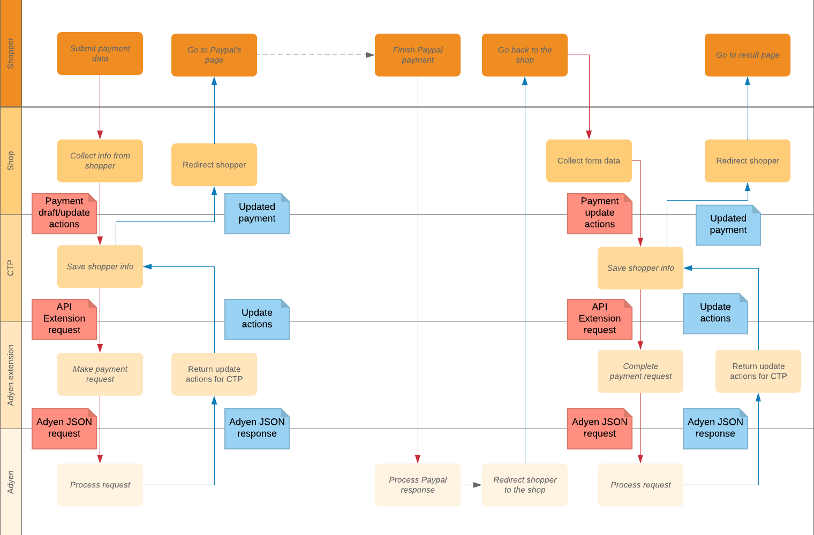

## Paypal payment

<!-- START doctoc generated TOC please keep comment here to allow auto update -->
<!-- DON'T EDIT THIS SECTION, INSTEAD RE-RUN doctoc TO UPDATE -->
**Contents**

- [Paypal](#paypal)

<!-- END doctoc generated TOC please keep comment here to allow auto update -->

Adyen documentation: https://docs.adyen.com/developers/payment-methods/paypal

**Please see [Integration Guide](IntegrationGuide.md) first before continuing with this document.**

### Paypal

1. [Enable Paypal in Adyen](https://docs.adyen.com/developers/payment-methods/paypal#prerequisites)
1. Backend creates a payment with following criteria:
    * `Payment.paymentMethodInfo.method = 'paypal'`
    * `Payment.transactions` contains a transaction with `type='Charge' and state='Initial'`
    * `Payment.custom.fields.returnUrl` contains return URL to which the shopper will be redirected after completion.
1. Adyen-integration make a payment request and save following information to the payment object:
    * `Payment.interfaceInteractions` contains request and response with Adyen
    * `Payment.transactions` with a transaction `type='Charge' and state='Initial'` will be changed to `'Pending'`.
    * `Payment.custom.fields.redirectUrl`  
    * `Payment.custom.fields.redirectMethod`
1. Frontend [redirects shopper](https://docs.adyen.com/developers/payment-methods/paypal#step2redirectshopper) to Paypal.
1. After shopper finishes the payment, she got redirected back to the shop. Backend gets from the query string a parameter `details.payload` and saves the parameter into the Payment custom field `Payment.custom.fields.payload`
1. Adyen-integration make a [payment request](https://docs.adyen.com/developers/payment-methods/paypal#step4presentpaymentresult) and save following information to the payment object:
    * `Payment.interfaceInteractions` contains request and response with Adyen 
    * `Payment.transactions` with a transaction `type='Charge' and state='Pending'` will be changed to a new state according to [the returned result code](IntegrationGuide.md#mapping-from-adyen-result-codes-to-ctp-transaction-state).
    * `pspReference` will be saved in a matching transaction from the previous point in a field `transactionInteractionId`
1. Frontend presents the results to the shopper.
     
*Notice*: the last step of Adyen-integration is mandatory but it doesn't play any significant role for Adyen.
Funds has already been reserved/transferred after the shopper confirms payment on Paypal. Nevertheless, it's important
to follow all the steps as it's the only way to get `pspReference` from Adyen.  

