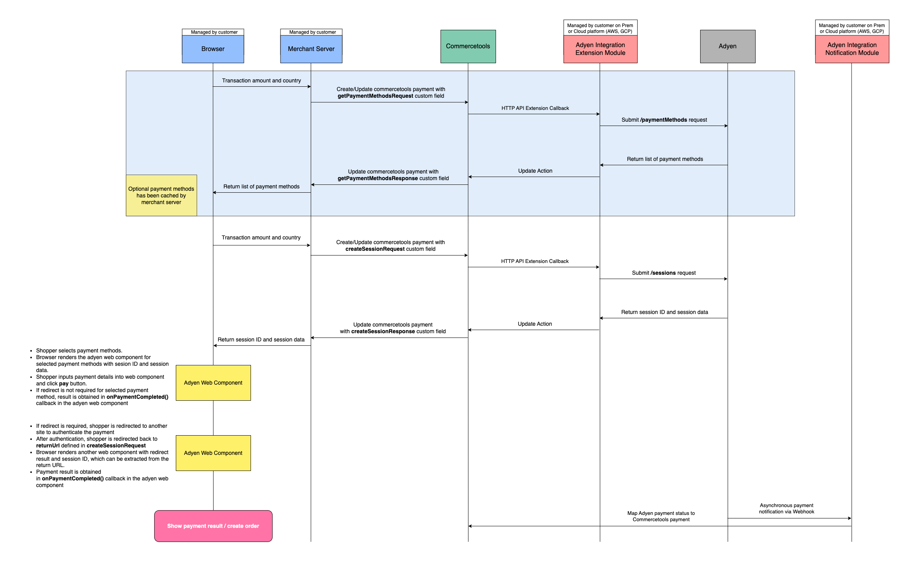

# Integration Guide

<!-- START doctoc generated TOC please keep comment here to allow auto update -->
<!-- DON'T EDIT THIS SECTION, INSTEAD RE-RUN doctoc TO UPDATE -->

- [Web Components integration guide](#web-components-integration-guide)
  - [How it works](#how-it-works)
  - [Before you begin](#before-you-begin)
  - [Step 1: commercetools checkout validations](#step-1-commercetools-checkout-validations)
    - [Validate cart state](#validate-cart-state)
    - [Recalculate cart](#recalculate-cart)
    - [Validate payment](#validate-payment)
    - [Validate payment transaction](#validate-payment-transaction)
  - [Step 2: Creating a commercetools payment](#step-2-creating-a-commercetools-payment)
  - [Step 3: Get available payment methods (Optional)](#step-3-get-available-payment-methods-optional)
  - [Step 4: Create a payment session](#step-4-create-a-payment-session)
    - [Response](#response)
      - [Handle Redirect](#handle-redirect)
    - [Adding cart and product informations (lineItems) to the request](#adding-cart-and-product-informations-lineitems-to-the-request)
  - [Step 5: Set up Web Component](#step-5-set-up-web-component)
  - [Step 6: Get payment result](#step-6-get-payment-result)
  - [Error handling](#error-handling)
    - [Extension module errors](#extension-module-errors)
    - [Shopper successfully paid but `redirectUrl` was not reached](#shopper-successfully-paid-but-redirecturl-was-not-reached)
    - [Shopper tries to pay a different amount than the actual order amount](#shopper-tries-to-pay-a-different-amount-than-the-actual-order-amount)
  - [Test and go live](#test-and-go-live)
- [Manual Capture](#manual-capture)
- [Cancel or refund](#cancel-or-refund)
- [Restore](#restore)
- [Multi-tenancy](#multi-tenancy)

<!-- END doctoc generated TOC please keep comment here to allow auto update -->

# Web Components integration guide

Terms used in this guide:

- **Shopper** - a person that's using the shop.
- **Browser** - frontend part of the checkout UI (webshop).
- **Merchant server** - backend part of the checkout.
- **Extension module** - [extension module](https://github.com/commercetools/commercetools-adyen-integration#extension-module) configured as [commercetools HTTP API Extensions](https://docs.commercetools.com/api/projects/api-extensions) is handling checkout steps by intercepting payment modifications and communicating with Adyen API.
- **Notification module** - [notification module](https://github.com/commercetools/commercetools-adyen-integration#notification-module) processes asynchronous notifications from Adyen and stores payment state changes in commercetools payment object.

The following diagram shows checkout integration flow based on [Adyen Web Components](https://docs.adyen.com/online-payments/build-your-integration?platform=Web&integration=Components&version=5.53.2#how-it-works).



## How it works

On this page we describe the checkout integration steps between the extension module and Adyen Web Components:

- [Step 1](#step-1-commercetools-checkout-validations) : Execute required checkout validations.
- [Step 2](#step-2-creating-a-commercetools-payment) : Create the commercetools payment object.
- [Step 3 - Optional](#step-3-get-available-payment-methods-optional) : Set `getPaymentMethodsRequest` custom field to commercetools payment to get the list of payment methods available for the checkout.
- [Step 4](#step-4-create-a-payment-session) : Submit a session request by setting `createSessionRequest` payment custom field with the basic payment data such as amount, currency and return URL.
- [Step 5](#step-5-set-up-web-component) : Add Adyen Web Component to your checkout payments form.
- [Step 6](#step-6-get-payment-result) : Get the result from asynchronous payment notification.

## Before you begin

In order to make the extension module up and running, follow our [how to run guide](./HowToRun.md).

## Step 1: commercetools checkout validations

The merchant server should execute the following validations:

1. On each checkout step [validate cart state](#validate-cart-state)
1. Before starting a new payment process make sure there are no paid payments on the cart already:
   - [Recalculate cart](#recalculate-cart)
   - [Validate payment](#validate-payment)
   - [Validate payment transaction](#validate-payment-transaction)

If all the above validations passed then the order can be created right away and the order confirmation page shown.
Otherwise, the shopper might continue with further payment steps.

### Validate cart state

Check if [current cart has been ordered already](https://docs.commercetools.com/api/projects/carts#cartstate) (`Cart.cartState = Ordered`).
In this case, load order by ordered cart ID and show order confirmation page.
This might happen if the cart has been already ordered in a different tab (edge case)
or by an optional asynchronous process like [commercetools-payment-to-order-processor job](https://github.com/commercetools/commercetools-payment-to-order-processor).

### Recalculate cart

[Execute cart recalculate](https://docs.commercetools.com/api/projects/carts#recalculate) to ensure:

- Cart totals are always up-to-date
- Time-limited discounts are eventually removed from the cart (discounts are validated on re-calculate and order creation only).

### Validate payment

There must be at least one commercetools payment object of type Adyen (`Payment.paymentMethodInfo.paymentInterface = ctp-adyen-integration`).

### Validate payment transaction

Cart's payment counts as successful if there is at least one payment object
with successful transaction state (`Payment.Transaction.state=Success`)
and transaction type `Authorization` or `Charge`.

## Step 2: Creating a commercetools payment

Before the actual payment process, commercetools payment resource needs to be created by the merchant server.

In the commercetools platform, payment represents just a container of the current state of receiving and/or refunding money.
The actual financial process is performed behind the scenes by the extension module which processes commercetools payment payload supplied by the merchant server and exchanges it with Adyen API.

The commercetools [payment](https://docs.commercetools.com/api/projects/payments#payment) does not contain by default all the required Adyen specific fields, so those have to be set as custom fields via a payment method-specific payment type.

Specifying the **required** fields:

| Field name                              | Value                                                                                                                      |
| --------------------------------------- | -------------------------------------------------------------------------------------------------------------------------- |
| `amountPlanned`                         | How much money this payment intends to receive from the customer. The value usually matches the cart or order gross total. |
| `paymentMethodInfo.paymentInterface`    | `ctp-adyen-integration`                                                                                                    |
| `custom.type.key`                       | `ctp-adyen-integration-web-components-payment-type`                                                                        |
| `custom.fields.adyenMerchantAccount`    | Adyen merchant account as a custom field called `adyenMerchantAccount`.                                                    |
| `custom.fields.commercetoolsProjectKey` | commercetools project key as a custom field called `commercetoolsProjectKey`.                                              |

In case of the absence of the required fields above, payment creation **will be rejected**.

Here's an example of how you would create a commercetools payment draft from scratch:

```json
{
  "amountPlanned": {
    "currencyCode": "EUR",
    "centAmount": 1000
  },
  "paymentMethodInfo": {
    "paymentInterface": "ctp-adyen-integration"
  },
  "custom": {
    "type": {
      "typeId": "type",
      "key": "ctp-adyen-integration-web-components-payment-type"
    },
    "fields": {
      "adyenMerchantAccount": "YOUR_MERCHANT_ACCOUNT",
      "commercetoolsProjectKey": "YOUR_COMMERCETOOLS_PROJECT_KEY"
    }
  }
}
```

Create a [payment](https://docs.commercetools.com/api/projects/payments#create-payment) with commercetools API.

After successful payment creation always [add](https://docs.commercetools.com/api/projects/carts#add-payment) it to the appropriate cart.

## Step 3: Get available payment methods (Optional)

When your shopper is ready to pay, you may request through the integration a list of the available payment methods based on the transaction context (like amount, country, and currency) and use it to render web-components based Adyen payment input forms.

> This step is optional but Adyen recommends to use it so that merchant server can always serve latest list of payment methods. During checkout you might also want to cache the list instead of requesting it every time a customer attempts to pay.

To get available payment methods via our integration, you need to set the `getPaymentMethodsRequest` custom field to your existing commercetools payment or create a payment right away with the custom fieldset.

> If you don't have a payment object, check [creating a new commercetools payment](#step-2-creating-a-commercetools-payment) and set `getPaymentMethodsRequest` custom field together with other required fields.

Here's an example of the `getPaymentMethodsRequest` custom field value for a German shopper and payment amount of `10 EUR`:

```json
{
  "countryCode": "DE",
  "shopperLocale": "de-DE",
  "amount": {
    "currency": "EUR",
    "value": 1000
  }
}
```

> Refer Adyen's [/paymentMethods](https://docs.adyen.com/api-explorer/#/PaymentSetupAndVerificationService/paymentMethods) request to check all possible request payload parameters.

<details>
  <summary>The commercetools payment representation example with getPaymentMethodsRequest. Click to expand.</summary>
    
```json
{
  "amountPlanned": {
    "currencyCode": "EUR",
    "centAmount": 1000
  },
  "paymentMethodInfo": {
    "paymentInterface": "ctp-adyen-integration"
  },
  "custom": {
    "type": {
      "typeId": "type",
      "key": "ctp-adyen-integration-web-components-payment-type"
    },
    "fields": {
      "adyenMerchantAccount": "YOUR_MERCHANT_ACCOUNT",
      "commercetoolsProjectKey": "YOUR_COMMERCETOOLS_PROJECT_KEY",
      "getPaymentMethodsRequest": "{\"countryCode\":\"DE\",\"shopperLocale\":\"de-DE\",\"amount\":{\"currency\":\"EUR\",\"value\":1000}}"
    }
  }
}
```
</details>

The response includes the list of available payment methods:

```json
{
  "paymentMethods": [
    {
      "name": "Credit Card",
      "type": "scheme"
    },
    {
      "name": "SEPA Direct Debit",
      "type": "sepadirectdebit"
    }
  ]
}
```

Pass the `getPaymentMethodsResponse` custom field value to your front end. You might use this in the next step to show which payment methods are available for the shopper.

<details>
  <summary>The commercetools payment representation example with response. Click to expand.</summary>
    
```json
{
  "amountPlanned": {
    "currencyCode": "EUR",
    "centAmount": 1000
  },
  "paymentMethodInfo": {
    "paymentInterface": "ctp-adyen-integration"
  },
  "custom": {
    "type": {
      "typeId": "type",
      "key": "ctp-adyen-integration-web-components-payment-type"
    },
    "fields": {
      "adyenMerchantAccount": "YOUR_MERCHANT_ACCOUNT",
      "commercetoolsProjectKey": "YOUR_COMMERCETOOLS_PROJECT_KEY",
      "getPaymentMethodsRequest": "{\"countryCode\":\"DE\",\"shopperLocale\":\"de-DE\",\"amount\":{\"currency\":\"EUR\",\"value\":1000}}",
      "getPaymentMethodsResponse": "{\"paymentMethods\":[{\"configuration\":{\"intent\":\"capture\"},\"name\":\"PayPal\",\"type\":\"paypal\"},{\"brands\":[\"visa\",\"mc\",\"amex\",\"maestro\",\"uatp\",\"cup\",\"diners\",\"discover\",\"hipercard\",\"jcb\"],\"details\":[{\"key\":\"encryptedCardNumber\",\"type\":\"cardToken\"},{\"key\":\"encryptedSecurityCode\",\"type\":\"cardToken\"},{\"key\":\"encryptedExpiryMonth\",\"type\":\"cardToken\"},{\"key\":\"encryptedExpiryYear\",\"type\":\"cardToken\"},{\"key\":\"holderName\",\"optional\":true,\"type\":\"text\"}],\"name\":\"Kreditkarte\",\"type\":\"scheme\"},{\"name\":\"Sofort.\",\"type\":\"directEbanking\"},{\"details\":[{\"key\":\"sepa.ownerName\",\"type\":\"text\"},{\"key\":\"sepa.ibanNumber\",\"type\":\"text\"}],\"name\":\"SEPA Lastschrift\",\"type\":\"sepadirectdebit\"},{\"name\":\"Rechnung mit Klarna.\",\"type\":\"klarna\"},{\"name\":\"GiroPay\",\"type\":\"giropay\"},{\"name\":\"Ratenkauf mit Klarna.\",\"type\":\"klarna_account\"},{\"brand\":\"givex\",\"details\":[{\"key\":\"encryptedCardNumber\",\"type\":\"cardToken\"},{\"key\":\"encryptedSecurityCode\",\"optional\":true,\"type\":\"cardToken\"},{\"key\":\"encryptedExpiryMonth\",\"optional\":true,\"type\":\"cardToken\"},{\"key\":\"encryptedExpiryYear\",\"optional\":true,\"type\":\"cardToken\"},{\"key\":\"encryptedPassword\",\"optional\":true,\"type\":\"cardToken\"},{\"key\":\"holderName\",\"optional\":true,\"type\":\"text\"}],\"name\":\"Givex\",\"type\":\"giftcard\"},{\"name\":\"Sofort bezahlen mit Klarna.\",\"type\":\"klarna_paynow\"},{\"brand\":\"svs\",\"details\":[{\"key\":\"encryptedCardNumber\",\"type\":\"cardToken\"},{\"key\":\"encryptedSecurityCode\",\"optional\":true,\"type\":\"cardToken\"},{\"key\":\"encryptedExpiryMonth\",\"optional\":true,\"type\":\"cardToken\"},{\"key\":\"encryptedExpiryYear\",\"optional\":true,\"type\":\"cardToken\"},{\"key\":\"encryptedPassword\",\"optional\":true,\"type\":\"cardToken\"},{\"key\":\"holderName\",\"optional\":true,\"type\":\"text\"}],\"name\":\"SVS\",\"type\":\"giftcard\"}]}"
    }
  }
}
```
</details>

## Step 4: Create a payment session

To create payment session via our integration, you need to set the `createSessionRequest` custom field to existing commercetools payment.

The request payload of for payment session creation only requires basic information from users, such as amount with currency, return URL, reference, merchant account.

> For details, consult the [Adyen documentation](https://docs.adyen.com/online-payments/web-components#create-payment-session)

> If you don't have a payment object, check [creating a new commercetools payment](#step-2-creating-a-commercetools-payment) and set `createSessionRequest` custom field together with other required fields.

After payment session is created successfully, you can obtain session ID and session data from the response. The response can be retrieved in the `createSessionResponse` custom field from the existing commercetools payment. The session ID and session data are required to set up web component in the next step.

**Preconditions**

- `createSessionRequest` must contain a unique payment `reference` value. The reference value cannot be duplicated in any commercetools payment and it's a required field by Adyen. The extension module uses the `reference` value to set the payment key in initial stage, later notification module uses it to look up corresponding payment after receiving notification for successful payment session creation. `Reference` may only contain alphanumeric characters, underscores and hyphens and must have a minimum length of 2 characters and a maximum length of 80 characters.
- `payment.amountPlanned` can not be changed if there is a `createSession` interface interaction present in the commercetools payment object. The `amount` value in `createSessionRequest` custom field must have the same value as `payment.amountPlanned`. This ensures eventual payment amount manipulations (i.e.: when [my-payments](https://docs.commercetools.com/api/projects/me-payments#my-payments) are used) for already initiated payment. In case `amountPlanned` needs to be changed and an existing commercetools payment resource with interface interaction of type `createSession` exists, please create a new commercetools payment instead of modifying the existing one.

**Important**

In this integration document our Adyen payment request examples are trimmed to minimum. Depending on your requirements you might want to include other Adyen parameters such as [add risk management fields](https://docs.adyen.com/risk-management/configure-standard-risk-rules/required-risk-field-reference) or [allow recurring payments](https://docs.adyen.com/payment-methods/cards/web-component#create-a-token).
Please find all the possible parameters in the `Web Components` section of the desired payment method listed in the navigation [here](https://docs.adyen.com/payment-methods).

Here's an example of the `createSessionRequest` custom field value for 3D Secure 2 credit card payment :

```json
{
  "amount": {
    "currency": "EUR",
    "value": 1000
  },
  "reference": "YOUR_REFERENCE",
  "channel": "Web",
  "returnUrl": "https://your-company.com/...",
  "merchantAccount": "YOUR_MERCHANT_ACCOUNT"
}
```

An example of payment [setCustomField](https://docs.commercetools.com/api/projects/payments#update-payment) action with the prepared data above.

```json
{
  "version": "PAYMENT_VERSION",
  "actions": [
    {
      "action": "setCustomField",
      "name": "createSessionRequest",
      "value": "{ \"amount\": { \"currency\": \"EUR\", \"value\": 1000 }, \"reference\": \"YOUR_REFERENCE\", \"channel\": \"Web\", \"returnUrl\": \"https://your-company.com/...\", \"merchantAccount\": \"YOUR_MERCHANT_ACCOUNT\" }"
    }
  ]
}
```

<details>
  <summary>The commercetools payment representation example with createSessionRequest request. Click to expand.</summary>
    
```json
{
  "amountPlanned": {
    "currencyCode": "EUR",
    "centAmount": 1000
  },
  "paymentMethodInfo": {
    "paymentInterface": "ctp-adyen-integration"
  },
  "custom": {
    "type": {
      "typeId": "type",
      "key": "ctp-adyen-integration-web-components-payment-type"
    },
    "fields": {
      "adyenMerchantAccount": "YOUR_MERCHANT_ACCOUNT",
      "commercetoolsProjectKey": "YOUR_COMMERCETOOLS_PROJECT_KEY",
      "createSessionRequest": "{ \"amount\": { \"currency\": \"EUR\", \"value\": 1000 }, \"reference\": \"YOUR_REFERENCE\", \"channel\": \"Web\", \"returnUrl\": \"https://your-company.com/...\", \"merchantAccount\": \"YOUR_MERCHANT_ACCOUNT\" }"
    }
  }
}
```
</details>

> For the sake of readability, the field [`applicationInfo`](https://docs.adyen.com/development-resources/building-adyen-solutions#building-a-plugin) is omitted from all the examples in this document. In real requests, [`applicationInfo`](https://docs.adyen.com/development-resources/building-adyen-solutions#building-a-plugin) is always added.

### Response

The payment response contains information for the next steps of the payment process. On a successful payment response, commercetools payment `key` is set with the `reference` of the `createSessionRequest`, and the response from Adyen is set to `createSessionResponse` custom field.

Next steps depend on whether the `createSessionResponse` custom field contains an action object.

> Refer our [error handling](#error-handling) section, in case you encounter errors in your integration.

Here's an example of the `createSessionResponse` custom field value

```json
{
  "amount": {
    "currency": "EUR",
    "value": 1000
  },
  "channel": "Web",
  "expiresAt": "2023-02-17T11:35:33+01:00",
  "id": "CSF86BB73115FBC5D0",
  "merchantAccount": "YOUR_MERCHANT_ACCOUNT",
  "reference": "YOUR_REFERENCE",
  "returnUrl": "https://your-company.com/...",
  "mode": "embedded",
  "sessionData": "Ab02b4c0!BQABAgAJTWczsOnM2OfQiSIe2OBwocp8oaXCbcRDBq9+7BlIocB9Yge4G0T9NygFsfawRu1Q8sX1QdU7yRNFi22JjLA1Ir8GnXKpntQrSP1jNjeOfGzQ1Gd9unwbANzieM7TIwvWBcZ3oEG4KULV7vtrwKJ49BMPJCxm324yx5wGUX0zsObFimbg879oYtPQ37iGDDxzuBt6Ykd5qT9KWv9V2X/MBY/YzWAgPfa0Ge7yQYbw4yckAwrWlj/ZRidGTCX3QxfjCI33CA3iBuQQ1tlgTHAyG7BWa+H03x6L6ePG/bqr4zdOf2zwk3MCwDX85sc/S4fipGmgTIADj+eCbuFr0MmVX2eogi/eBdF2koXpcfRsfL/SvvQS4D1HcOnz6ol3S2tOQN2y7Iw/tTfVM+5piarSskzx4Nbt0WHdrBD7K02GKCUhW/FI50isQoKAkL4kTfPG5GIWCWfY2TfE0lj+VgKofwn3CFI5Rw7BwRDp0kFeeI3N45nvVUFbN9X4jJz/FiR67X1pa9SCy2Qbzs5IdUg+kD20TjAtenqaMFF9A5/KNwa/1aBaA540+Xzon8R6s7LiCtmp6JDUg6UuDsfLpkHR1J5zKZziWglaHNzKpu1i38+70LAc2dDT2WON662r+mw5hUx1T2x9bfVL429YwlGfda0ciz/SuEp54EINg9FSvQznSoHzLQp56Fqd1j0ASnsia2V5IjoiQUYwQUFBMTAzQ0E1MzdFQUVEODdDMjRERDUzOTA5QjgwQTc4QTkyM0UzODIzRDY4REFDQzk0QjlGRjgzMDVEQyJ9mzQ0ZhdH9ofifR2Ut1dGxRPkc0VEf9CTWSOZ12vL0O6DQpQH7KSEJ/JQCOzenhuuldhRNCfhK33hvYaLhHoFNvDI5/66uRjMiG9bZeQSlb7wI0UoByPGoUbWYXihIGrMCVstX/6evF3EYGlGhKvE7HSR7LFOzbyFxYc/N3vq4IYTvOQztUm+IPT9bUjY3nxFx4Khd/0FZ7JpyI7lvEXMGhY+L7gjsLvzy98sqLC40w1GI7zpR4O2UTNGy6ZPJ5ECEPzVr74dz9LaWmzpCPulWNSqVbHxD3mYnWqKmueQH2ozXaFRo/HQIk/BKvYREKz1iR1ES2Kq6BSVAMx+gyHiPPeMKH0RnuVNcqe/SMXveWpanx+RCoaidcmxyrFZH8n2SfC5FVCt5YMol8zFPbeu+c1js/4/KOm273qdbBsw+EelGh1lKbwZa24rLUhDUm9WxDPR1ukAIOvxW+xQ40BmYikW2ewlrUMTwwgarA=="
}
```

`id` and `sessionData` value is mandatory to set up web component

<details>
 <summary> A commercetools payment with createSessionResponse field with the response above. Click to expand. </summary>

```json
{
  "amountPlanned": {
    "type": "centPrecision",
    "currencyCode": "EUR",
    "centAmount": 1000,
    "fractionDigits": 2
  },
  "custom": {
    "type": {
      "typeId": "type",
      "key": "ctp-adyen-integration-web-components-payment-type"
    },
    "fields": {
      "adyenMerchantAccount": "YOUR_MERCHANT_ACCOUNT",
      "commercetoolsProjectKey": "YOUR_COMMERCETOOLS_PROJECT_KEY",
      "createSessionRequest": "{ \"amount\": { \"currency\": \"EUR\", \"value\": 1000 }, \"reference\": \"YOUR_REFERENCE\", \"channel\": \"Web\", \"returnUrl\": \"https://your-company.com/...\", \"merchantAccount\": \"YOUR_MERCHANT_ACCOUNT\" }",
      "createSessionResponse": "{ \"amount\": { \"currency\": \"EUR\", \"value\": 1000 }, \"channel\": \"Web\", \"expiresAt\": \"2023-02-17T11:35:33+01:00\", \"id\": \"CSF86BB73115FBC5D0\", \"merchantAccount\": \"YOUR_MERCHANT_ACCOUNT\", \"reference\": \"YOUR_REFERENCE\", \"returnUrl\": \"https://your-company.com/...\", \"mode\": \"embedded\", \"sessionData\": \"Ab02b4c0!BQABAgAJTWczsOnM2OfQiSIe2OBwocp8oaXCbcRDBq9+7BlIocB9Yge4G0T9NygFsfawRu1Q8sX1QdU7yRNFi22JjLA1Ir8GnXKpntQrSP1jNjeOfGzQ1Gd9unwbANzieM7TIwvWBcZ3oEG4KULV7vtrwKJ49BMPJCxm324yx5wGUX0zsObFimbg879oYtPQ37iGDDxzuBt6Ykd5qT9KWv9V2X/MBY/YzWAgPfa0Ge7yQYbw4yckAwrWlj/ZRidGTCX3QxfjCI33CA3iBuQQ1tlgTHAyG7BWa+H03x6L6ePG/bqr4zdOf2zwk3MCwDX85sc/S4fipGmgTIADj+eCbuFr0MmVX2eogi/eBdF2koXpcfRsfL/SvvQS4D1HcOnz6ol3S2tOQN2y7Iw/tTfVM+5piarSskzx4Nbt0WHdrBD7K02GKCUhW/FI50isQoKAkL4kTfPG5GIWCWfY2TfE0lj+VgKofwn3CFI5Rw7BwRDp0kFeeI3N45nvVUFbN9X4jJz/FiR67X1pa9SCy2Qbzs5IdUg+kD20TjAtenqaMFF9A5/KNwa/1aBaA540+Xzon8R6s7LiCtmp6JDUg6UuDsfLpkHR1J5zKZziWglaHNzKpu1i38+70LAc2dDT2WON662r+mw5hUx1T2x9bfVL429YwlGfda0ciz/SuEp54EINg9FSvQznSoHzLQp56Fqd1j0ASnsia2V5IjoiQUYwQUFBMTAzQ0E1MzdFQUVEODdDMjRERDUzOTA5QjgwQTc4QTkyM0UzODIzRDY4REFDQzk0QjlGRjgzMDVEQyJ9mzQ0ZhdH9ofifR2Ut1dGxRPkc0VEf9CTWSOZ12vL0O6DQpQH7KSEJ/JQCOzenhuuldhRNCfhK33hvYaLhHoFNvDI5/66uRjMiG9bZeQSlb7wI0UoByPGoUbWYXihIGrMCVstX/6evF3EYGlGhKvE7HSR7LFOzbyFxYc/N3vq4IYTvOQztUm+IPT9bUjY3nxFx4Khd/0FZ7JpyI7lvEXMGhY+L7gjsLvzy98sqLC40w1GI7zpR4O2UTNGy6ZPJ5ECEPzVr74dz9LaWmzpCPulWNSqVbHxD3mYnWqKmueQH2ozXaFRo/HQIk/BKvYREKz1iR1ES2Kq6BSVAMx+gyHiPPeMKH0RnuVNcqe/SMXveWpanx+RCoaidcmxyrFZH8n2SfC5FVCt5YMol8zFPbeu+c1js/4/KOm273qdbBsw+EelGh1lKbwZa24rLUhDUm9WxDPR1ukAIOvxW+xQ40BmYikW2ewlrUMTwwgarA==\" }"
    }
  }
}
```

</details>

Notice that the payment is not yet authorised at this moment. You need to set up web component and initiate the payment on front-end afterwards. The authorisation result then is sent from Adyen to notification module asynchronously.

#### Handle Redirect

Some payment methods require additional action from the shopper in a redirect page, such as: to scan a QR code, to authenticate a payment with 3D Secure, or to log in to their bank's website to complete the payment.
In this case you have to handle it on the return URL front-end page.

> See [Adyen documentation](https://docs.adyen.com/online-payments/web-components#handle-redirect-result) for more information how to perform additional front end actions.

### Adding cart and product informations (lineItems) to the request

For some payment methods, it is necessary to provide [line item details](https://docs.adyen.com/api-explorer/#/PaymentSetupAndVerificationService/latest/payments__reqParam_lineItems) within the `createSessionRequest`.

Extension module can generate the line item automatically, but you need to do following steps:

- The commercetools payment [referenced in the commercetools cart](https://docs.commercetools.com/api/projects/carts#add-payment).
- Either `addCommercetoolsLineItems` property set to`true` within the `createSessionRequest` or `addCommercetoolsLineItems` flag set to `true` within your extension [configuration](./HowToRun.md#other-configurations).
  > In case you would like to override the generation of the lineItems please provide within the `createSessionRequest` own `lineItems` data.

Here's an example of the `createSessionRequest` **WITHOUT** `lineItems` and `addCommercetoolsLineItems` property set to true.

```json
{
  "merchantAccount": "YOUR_MERCHANT_ACCOUNT",
  "reference": "YOUR_REFERENCE",
  "amount": {
    "currency": "EUR",
    "value": "1000"
  },
  "shopperLocale": "en_US",
  "countryCode": "SE",
  "shopperEmail": "youremail@email.com",
  "shopperName": {
    "firstName": "Testperson-se",
    "gender": "UNKNOWN",
    "lastName": "Approved"
  },
  "shopperReference": "YOUR_UNIQUE_SHOPPER_ID_IOfW3k9G2PvXFu2j",
  "billingAddress": {
    "city": "Ankeborg",
    "country": "SE",
    "houseNumberOrName": "1",
    "postalCode": "12345",
    "street": "Stargatan"
  },
  "returnUrl": "https://www.your-company.com/...",
  "addCommercetoolsLineItems": true
}
```

[Update commercetools payment](https://docs.commercetools.com/api/projects/payments#update-payment) with the request above.

```json
{
  "version": "PAYMENT_VERSION",
  "actions": [
    {
      "action": "setCustomField",
      "name": "createSessionRequest",
      "value": "{ \"merchantAccount\": \"YOUR_MERCHANT_ACCOUNT\", \"reference\": \"YOUR_REFERENCE\", \"amount\": { \"currency\": \"EUR\", \"value\": \"1000\" }, \"shopperLocale\": \"en_US\", \"countryCode\": \"SE\", \"shopperEmail\": \"youremail@email.com\", \"shopperName\": { \"firstName\": \"Testperson-se\", \"gender\": \"UNKNOWN\", \"lastName\": \"Approved\" }, \"shopperReference\": \"YOUR_UNIQUE_SHOPPER_ID_IOfW3k9G2PvXFu2j\", \"billingAddress\": { \"city\": \"Ankeborg\", \"country\": \"SE\", \"houseNumberOrName\": \"1\", \"postalCode\": \"12345\", \"street\": \"Stargatan\" }, \"returnUrl\": \"https://www.your-company.com/...\" }"
    }
  ]
}
```

<details>
<summary>Extension module will add line items to your createSessionRequest. Click to expand.</summary>

```json
{
  "merchantAccount": "YOUR_MERCHANT_ACCOUNT",
  "reference": "YOUR_REFERENCE",
  "paymentMethod": {
    "type": "YOUR_PAYMENT_METHOD"
  },
  "amount": {
    "currency": "EUR",
    "value": "1000"
  },
  "shopperLocale": "en_US",
  "countryCode": "SE",
  "shopperEmail": "youremail@email.com",
  "shopperName": {
    "firstName": "Testperson-se",
    "gender": "UNKNOWN",
    "lastName": "Approved"
  },
  "shopperReference": "YOUR_UNIQUE_SHOPPER_ID_IOfW3k9G2PvXFu2j",
  "billingAddress": {
    "city": "Ankeborg",
    "country": "SE",
    "houseNumberOrName": "1",
    "postalCode": "12345",
    "street": "Stargatan"
  },
  "returnUrl": "https://www.your-company.com/...",
  "lineItems": [
    {
      "quantity": "1",
      "amountExcludingTax": "331",
      "taxPercentage": "2100",
      "description": "Shoes",
      "id": "Item #1",
      "taxAmount": "69",
      "amountIncludingTax": "400"
    },
    {
      "quantity": "2",
      "amountExcludingTax": "248",
      "taxPercentage": "2100",
      "description": "Socks",
      "id": "Item #2",
      "taxAmount": "52",
      "amountIncludingTax": "300"
    }
  ]
}
```

</details>

By default, the extension module will populate `lineItems` for you but in case you want to define your own values include `lineItems` in your `createSessionRequest`.

Remind that if line items are not provided in `createSessionRequest`, the returned session ID and session data would not support any payment methods which require line items, such as affirm, klarna, etc.

## Step 5: Set up Web Component

Next, use the Adyen Web Components to render the payment method, and collect the required payment details from the shopper.

If you haven't created the payment forms already in your frontend, follow the official Adyen [Web Component integration guide](https://docs.adyen.com/online-payments/web-components#set-up).

## Step 6: Get payment result

After payment is initialized on front-end, you can get the result from Adyen asynchronously. The notification module would receive the result with eventCode `AUTHORISATION` and
update it to commercetools payment `interfaceInteraction` custom fields. Also, `pspReference` can be obtained from the notification result in notification module, which is set as commercetools payment key.

For details, please follow [Get payment outcome](https://docs.adyen.com/online-payments/web-components#get-payment-outcome)

## Error handling

In case you encounter errors in your integration, refer to the following:

### API logs in CommerceTools backend

Log into the [CommerceTools Merchant Center](https://mc.europe-west1.gcp.commercetools.com/) and navigate to the following section: **CT Merchant Center -> Orders -> Select Order -> Payments Tab -> View PSP transaction log**.
From here on you can collapse the different sections to see the API requests and responses sent to Adyen and possible received webhooks for the specific order.

### Extension module errors

If you receive a `non-HTTP 200 response`, use the commercetools payment `interface interactions` to troubleshoot the response.

Interface interactions can represent a `request` sent to Adyen, a `response`, or a `notification` received from Adyen.
Some interactions may result in a transaction. If so, the interactionId in the payment transaction will be set to match the `pspReference` of the Adyen API.

### Shopper successfully paid but `redirectUrl` was not reached

In some payment redirect cases, there might be a valid payment but no order as the shopper did not reach the shop's `redirectUrl`.
For example, after successfully issued payment shopper loses internet connection or accidentally closes the tab.
In this case [Notification module](../../notification) will receive asynchronously a notification from Adyen with payment confirmation which will result in a transaction creation or transaction state change.
An optional usage of scheduled [commercetools-payment-to-order-processor](https://github.com/commercetools/commercetools-payment-to-order-processor) job ensures that for every successful payment
an order can still be asynchronously created.

### Shopper tries to pay a different amount than the actual order amount

For redirect payments payment amount is bound to `redirectUrl`.
After redirect and before the actual finalization of the payment at the provider's page, the shopper is still able to change the cart's amount within the second tab.
If the shopper decides to change the cart's amount within the second tab and finalize payment within the first tab, then according to payment amount [validation](#step-1-commercetools-checkout-validations) an error
has to be shown and order creation must be declined. In such a case, it might be reasonable to [cancel or refund](#cancel-or-refund) the invalid payment.

## Test and go live

Before you go live please follow [steps](https://docs.adyen.com/online-payments/web-components/integrated-before-5-0-0#testing-your-integration) described by Adyen.

- [Please check FAQ guide](../../docs/FAQ.md).

Additionally, follow the official Adyen [integration checklist](https://docs.adyen.com/development-resources/integration-checklist).

# Manual Capture

By default, payments are captured immediately (or with [delay](https://docs.adyen.com/online-payments/capture#capture-delay)) after authorisation. For payment methods that support separate authorization and capture, you also have the option to capture the payment later, for example only after the goods have been shipped. This also allows you to cancel the payment/authorization.

Payments like [Klarna](https://docs.adyen.com/payment-methods/klarna/web-component#capture) or [Affirm](https://docs.adyen.com/payment-methods/affirm/web-component#capture-the-payment) have to be manually captured by default, even if you have enabled automatic capture for other payment methods. Klarna can be configured to auto-capture if you contact Adyen Support.

If you need to explicitly request a capture for each payment please follow our [manual capture documentation](./ManualCapture.md).

# Cancel or refund

If you want to return the funds to your shopper, use either Cancel or Refund functionalities.

This will either:

- [**Cancel**](CancelPayment.md) - cancel the authorisation on an uncaptured payment(full payment).
- [**Refund**](Refund.md) - (partially) refund a payment back to the shopper.

# Restore

Restore gives your shoppers an opportunity to offset their carbon emissions from the delivery or lifecycle of their purchase at checkout.
For the integration details please follow our [restore documentation](./Restore.md).

# Multi-tenancy

`commercetools-adyen-integration` supports multi-tenancy to serve multiple Adyen merchant accounts/commercetools projects
with one application instance. This architectural style leverages sharing and scalability to provide cost-efficient hosting.

In order for `commercetools-adyen-integration` to know which project and merchant account it should communicate with, `adyenMerchantAccount` and `commercetoolsProjectKey` custom fields must be provided on payment creation.

> `commercetoolsProjectKey` is passed to Adyen using the field [`metadata.ctProjectKey`](https://docs.adyen.com/api-explorer/#/CheckoutService/v66/post/payments__reqParam_metadata). This field is also present in every notification from Adyen to help with matching the correct commercetools project.

**IMPORTANT: `commercetoolsProjectKey` must not have more than 80 characters. This is due to length restrictions of the Adyen API.**
